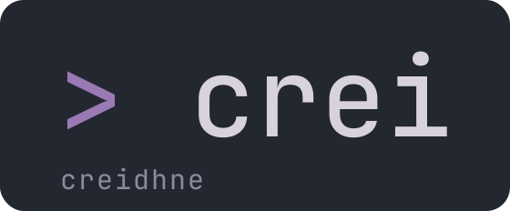

<div align="center">

<picture>
  <source media="(prefers-color-scheme: dark)" srcset="docs/images/logo-dark.svg">
  <source media="(prefers-color-scheme: light)" srcset="docs/images/logo-light.svg">
  
</picture>

<p></p>

[](https://github.com/lugoues/creidhne/releases)
[](LICENSE)
[](https://podman.io)

**Generate Podman Quadlet systemd units from typed, validated CUE, and reconcile them against your quadlet directory.**

</div>

---

**Creidhne** (`crei`) is a single-binary CLI that generates [Podman Quadlet](https://docs.podman.io/en/latest/markdown/podman-systemd.unit.5.html) systemd unit files from typed, validated [CUE](https://cuelang.org/) definitions and reconciles them against your quadlet directory (`plan` / `diff` / `apply`). It covers all 8 Quadlet unit types: Container, Pod, Volume, Network, Kube, Build, Image, and Artifact.

The binary **embeds the CUE evaluator and schema**, so you don't need `cue` (or anything else) installed to use it. Write CUE, run `crei apply`.

## Install

Creidhne runs on **Linux** with **systemd** and **Podman 4.4+** (Quadlet's minimum).

### Release binary
Pick your architecture from the [latest release](https://github.com/lugoues/creidhne/releases/latest):

### Mise (recommended)
This is by far the easiest way and it verifies the cosign signatures automatically. Folow the instructions at https://mise.jdx.dev/getting-started.html to get setup. Then create the file below and run `mise install` to install.
```toml
# my-quadlets/.mise/config.toml
[env]
QUADLET_DIR = "/etc/containers/systemd"
# DIFF_TOOL = "delta"

[tools]
deno = "latest"
"aqua:cue-lang/cue" = "0.16.0"
"github:lugoues/creidhne" = "1.9.0"
```

### Script
This script will download the latest binary, verify it's signatures, and install crei into `/usr/local/bin`.
```sh
ver=1.0.1
arch=amd64   # or arm64
base=https://github.com/lugoues/creidhne/releases/download/v$ver
curl -fsSLO "$base/crei_${ver}_linux_$arch"{,.sha256,.sigstore.json}

# integrity
echo "$(cat crei_${ver}_linux_$arch.sha256)  crei_${ver}_linux_$arch" | sha256sum -c -

# provenance: verify it was built by this repo's release workflow (keyless cosign)
cosign verify-blob \
  --bundle crei_${ver}_linux_$arch.sigstore.json \
  --certificate-identity-regexp '^https://github.com/lugoues/creidhne/' \
  --certificate-oidc-issuer https://token.actions.githubusercontent.com \
  crei_${ver}_linux_$arch

install -m755 crei_${ver}_linux_$arch /usr/local/bin/crei
```

### From source

```sh
go install github.com/lugoues/creidhne/cmd/crei@latest   # Go 1.25+
```

## Quick start

```sh
mkdir my-quadlets && cd my-quadlets
crei init                 # scaffolds cue.mod, main.cue, .crei/config.toml
$EDITOR main.cue          # define your quadlets
crei plan                 # preview changes against the quadlet dir
crei apply                # write the unit files
```

A quadlet with a container and a volume:

```cue
package quadlets

import "github.com/lugoues/creidhne@v0"

app: creidhne.#Quadlet & {
    name: "app"
    units: {
        #container: {
            Container: {
                Image:         "docker.io/myapp:latest"
                ContainerName: "app"
                Environment:   ["APP_ENV=production"]
                Volume:        ["app-data.volume:/data"]
                PublishPort:   ["8080:8080"]
            }
            Service: {
                Restart:   "always"
                MemoryMax: "1G"
            }
            Install: WantedBy: ["multi-user.target"]
        }
        volumes: data: {
            Volume: {
                VolumeName: "app-data"
            }
        }
    }
}
```

`crei apply` writes `app.container` and `app-data.volume` into your quadlet directory (default `~/.config/containers/systemd`), then tells you to run `systemctl --user daemon-reload` (or does it for you with `--reload-systemd`).

For a realistic, copyable setup (a Traefik pod with volumes, networks, and external unit dependencies), see [`example/`](example/).

## Writing quadlets

`#Quadlet` is the top-level wrapper: a `name` and a `units` block. CUE validates every field against the Podman Quadlet spec.

### Primary vs. additional units

- **Primary** units are `#`-prefixed fields (`#container`, `#pod`, `#volume`, ...). One per type; the file is named after the quadlet, so `name: "app"` + `#container` gives `app.container`.
- **Additional** units are plural maps (`containers`, `volumes`, ...) keyed by a handle. The file is `<quadlet>-<name>`, where `name` defaults to the key — so `volumes: data: {...}` gives `app-data.volume`, and `volumes: data: {name: "cache"}` gives `app-cache.volume`.

Mix both freely; a primary `#container` plus additional `volumes: data: {...}` is a common pattern.

```
#Quadlet
├── name: string                 # e.g. "traefik"
└── units: #Units
    ├── #container?: #Container   # primary  → traefik.container
    ├── #volume?:    #Volume      # primary  → traefik.volume
    ├── ...                       # all 8 types
    ├── containers: {...}         # additional → traefik-<key>.container
    └── volumes: {...}            # additional → traefik-<key>.volume
```

### List nesting

Every list field accepts one level of nesting and flattens it, so a helper
can hand you a block of values that you splice in place:

```cue
Label: ["app=web", #mySpec.#labels]   // renders as one flat Label list
```

Exactly one level: helpers emit flat lists, and deeper nesting stays a type
error.

### Cross-references

Every unit has computed `#ref` and `#service` fields for type-safe references. `#ref` is the Quadlet filename (e.g. `proxy.volume`) used in fields like `Volume`; `#service` is the systemd service Quadlet generates (e.g. `proxy-volume.service`) used in `Unit` fields like `After`/`Requires`.

Container, pod, volume, and network units also expose `#containerName` / `#podName` / `#volumeName` / `#networkName`, the **runtime resource name** podman assigns: the explicit `ContainerName`/etc. if you set one, otherwise podman's `systemd-<stem>` default. Use it where a real object name is required, e.g. `Network: ["container:\(db.units.#container.#containerName)"]`.

```cue
proxy: creidhne.#Quadlet & {
    name: "proxy"
    units: {
        #container: {
            Container: {
                Image:  "docker.io/nginx:latest"
                Volume: ["\(units.#volume.#ref):/etc/nginx/certs:ro"]
            }
            Unit: Requires: [units.#volume.#service]
        }
        #volume: {Volume: {}}
    }
}
// units.#volume.#ref     → "proxy.volume"
// units.#volume.#service → "proxy-volume.service"
```

For cross-quadlet references, reference the other quadlet's units directly:

```cue
app: creidhne.#Quadlet & {
    name: "app"
    units: #container: {
        Container: Image: "docker.io/myapp:latest"
        Unit: {
            After:    [db.units.#container.#service]
            Requires: [db.units.#container.#service]
        }
    }
}
```

### External dependencies

For systemd units not managed by this config, use `#ExternalUnits`:

```cue
externals: creidhne.#ExternalUnits & {
    targets: "network-online": _
    services: tailscaled: _
    sockets: podman: _
}

app: creidhne.#Quadlet & {
    name: "app"
    units: #container: {
        Container: Image: "docker.io/myapp:latest"
        Unit: After: [
            externals.targets["network-online"].#ref,
            externals.services.tailscaled.#ref,
        ]
    }
}
```

Well-known systemd targets (default, multi-user, network-online, graphical, ...) are pre-populated. Or skip the helper and use raw strings: `Unit: After: ["network-online.target"]`.

### Secrets

Declare the podman secrets your quadlets use in a `#SecretRegistry`, then reference them in a container's `Secret` field, adding the consumption details (the registry entry and the consumption fields unify into one secret reference):

```cue
secrets: creidhne.#SecretRegistry & {
    db_password: _                  // podman secret name defaults to the key
    tls_cert: {name: "tls-cert"}    // or set it explicitly
}

app: creidhne.#Quadlet & {
    name: "app"
    units: #container: {
        Container: {
            Image: "docker.io/myapp:latest"
            Secret: [
                secrets.db_password & {type: "env", target: "DB_PASSWORD"},
                secrets.tls_cert & {type: "mount", target: "/etc/ssl/cert.pem", mode: "0400"},
            ]
        }
    }
}
```

`crei secrets` reconciles that registry against podman's secret store:

```sh
crei secrets list               # table of each secret: present or missing in podman
crei secrets create db_password # create one, typing (hidden) or generating its value
crei secrets create -a          # walk through every secret missing from podman
```

`create` prompts for a value (hidden input) or generates a random one; a generated value is shown once so you can save it. Use `--replace` to overwrite an existing secret. The registry is read from the top-level `secrets` field by default; override with `secrets_field` in `crei.toml`.

### Inline Containerfile & Context
Craei supports inlining Containerfiles and their context within a Build unit. Context files will be placed next to the Containerfile when being build so `COPY . /` is all you need to pull your context in. This is useful when you want only minor changes to the original image (such as installing packages).
```
traefik: creidhne.#Quadlet & {
    name: "traefik"

    units: {
        // Build the traefik image from an inline Containerfile.
        #build: {
            Build: {
                BuildArg: ["TRAEFIK_VERSION=3.6.11"]
                ImageTag: ["localhost/traefik:quadlet"]
            }
            ContainerFile: """
                ARG TRAEFIK_VERSION
                FROM ghcr.io/traefik/traefik:${TRAEFIK_VERSION}

                COPY . /
                """
            Context: {
                "etc/traefik/traefik.yml": """
                    domain: mydomain.dev

                    api:
                      dashboard: true
                      insecure: false
                    """
            }
        }
    }
}
```

### Supported sections

Every unit type supports the standard systemd sections plus its own:

| Section | Description |
|---|---|
| `Unit` | Dependencies, ordering, conditions (After, Requires, Wants, ...) |
| `Service` | Restart policy, resource limits, exec hooks, environment |
| `Install` | WantedBy, RequiredBy, Alias, ... |
| `Quadlet` | `DefaultDependencies` toggle |

Plus the unit section (`[Container]`, `[Pod]`, ...). Every field from [podman-systemd.unit(5)](https://docs.podman.io/en/latest/markdown/podman-systemd.unit.5.html) is supported and documented with inline comments in the CUE source.

### Type safety

Fields are validated when you `crei validate` (or `crei plan`/`apply`):

```cue
#container: Container: {
    PublishPort: ["8080:80"]        // validated port mapping format
    Memory:      "512m"             // validated podman byte size
    Pull:        "always"           // enum: always | missing | never | newer
    UserNS:      "keep-id:uid=1000" // validated user namespace mode
}
```

Mutual exclusivity is enforced: `Image`/`Rootfs` and `ReloadCmd`/`ReloadSignal` cannot both be set.

## CLI

| Command | Description |
|---|---|
| `crei init` | Scaffold a project (`cue.mod`, `main.cue`, `.crei/config.toml`, `.crei/config.schema.json`) and vendor the CUE schema for editor/LSP support. |
| `crei render` | Render all unit files to stdout. |
| `crei plan` | Show what `apply` would add/update/remove, as an inline diff (`--no-diff` for the compact list). |
| `crei diff` | Show detailed diffs against the live files. |
| `crei apply` | Write/remove files. `--reload-systemd` runs `daemon-reload` (default from `reload_systemd` in `crei.toml`, else on); `-y` skips the prompt. |
| `crei status [quadlet...]` | One table of desired vs recorded vs disk vs runtime state per unit; name quadlets to drill in. `--problems` shows only rows needing attention, `--format json` for scripts, `--check` for cron/CI exit codes. Read-only. |
| `crei validate` | Type-check the CUE without rendering. |
| `crei import compose [file...]` | Convert a docker-compose project into a creidhne CUE file (see below). |
| `crei config` | Show the resolved configuration and where each value came from. |
| `crei secrets list` | List the secret registry and whether each secret exists in podman (alias: `ls`). |
| `crei secrets create` | Create a podman secret, entering or generating its value (`-a` walks every missing one). |
| `crei version` | Print version info. |

### Migrating from docker-compose

`crei import compose` converts a compose project into one `#Quadlet`:

```sh
crei import compose            # discovers compose.yaml like docker compose does
crei import compose -o - ...   # print to stdout instead of <project>.cue
crei import compose https://github.com/docker/awesome-compose/blob/master/nginx-golang/compose.yaml
```

URLs are fetched (GitHub/GitLab browser links are rewritten to their raw
form), and the project name derives from the URL directory (here:
`nginx-golang`) unless the file sets `name:` or `--name` is given. Relative
paths in a fetched file refer to the source repository layout, so run the
result from a checkout.

- Services become containers, named volumes/networks become units referenced
  via `#self`, `build:` sections become build units. Volumes and networks get fresh
  systemd-* names by default; pass `--preserve-names` when migrating an
  existing deployment so the compose-era volumes (and their data) are
  reused. `external: true` resources are always adopted by name.
- `depends_on` becomes `After=`+`Requires=`. A service with a `healthcheck:`
  gets the full notify wiring (`Notify=healthy`, `Type=notify`,
  `NotifyAccess=all`, and a derived `TimeoutStartSec` when the check math
  exceeds systemd's 90s default), so `systemctl start` waits for *healthy*,
  not just started, and `condition: service_healthy` ordering is actually
  enforced by systemd.
- `deploy.resources` limits land in the systemd `[Service]` block
  (`MemoryMax`, `CPUQuota`, `TasksMax`); the rest of `deploy.*` is swarm and is
  skipped with a warning.
- `${VAR}` references are not resolved by default: they are lifted into an
  `env:` struct that `crei validate` forces you to fill. Pass
  `--env-file`/`--env` to resolve and bake values at import time instead, or
  `--resolve` to bake using only the file's own `${VAR:-default}` values.
  Files that interpolate inside structured fields (like `ports:`) cannot be
  preserved symbolically; the error tells you which resolve mode to use.
- Compose secrets map onto the secret registry; values are never imported.
  The conversion report lists how to load each one (`crei secrets list` shows
  what is still missing).
- Anything unmappable is listed in the report, never dropped silently, and
  the source compose file is embedded at the bottom of the emitted CUE as a
  comment block for reference (`--embed-source=false` to skip).

### Recorded state and `crei status`

`apply` records what it wrote in a `crei.state` file next to the quadlet files
(the `kubectl` last-applied analogue): the evaluated manifest plus a hash of
every file. `crei status` compares four layers per unit and prints one table:

```
QUADLET  UNIT           DISK      LOADED         RUNTIME
app      app.container  synced    ok             ● running 2d4h
app      app.volume     pending   reload needed  -
db       db.container   tampered  ok             ✗ failed
```

- **DISK**: `synced`, `pending` (your CUE edit, run apply), `tampered` (the
  deployed file changed outside crei), `missing`, `orphan`, or `foreign` (a
  file crei never wrote; never touched).
- **LOADED**: whether systemd's generator has picked the file up (`ok`,
  `reload needed`, `not loaded`).
- **RUNTIME**: the service's state and uptime; `(stale)` marks a process
  started before the file's last apply, i.e. running the old config.

Every layer degrades independently (broken eval falls back to recorded state;
no systemd just blanks the runtime columns), and `--check` exits non-zero
unless everything is synced, loaded, and healthy. Reconciliation itself never
consults runtime state: files are the substrate, systemd is observability.

Configuration is resolved as **flags > environment > `crei.toml` > defaults**:

| Setting | Flag | Env | `crei.toml` | Default |
|---|---|---|---|---|
| Project dir | `-C`, `--dir` | n/a | n/a | `.` |
| Quadlet dir | `--quadlet-dir` | `QUADLET_DIR` | `quadlet_dir` | `~/.config/containers/systemd` |
| Diff tool | `--diff-tool` | `DIFF_TOOL` | `diff_tool` | built-in unified diff |
| Diff style | n/a | n/a | `diff_style` | `highlight` |
| Reload systemd after apply | `--reload-systemd` | n/a | `reload_systemd` | `true` (on, like `podman quadlet install`) |
| Secrets field | n/a | n/a | `secrets_field` | `secrets` |

Run `crei config` to print the resolved values and where each came from.

The config lives in `.crei/config.toml`. `crei init` also writes a JSON Schema (`.crei/config.schema.json`) and a `#:schema` directive at the top of `config.toml`, so editors with TOML support (e.g. [Even Better TOML](https://taplo.tamasfe.dev/) / Taplo) validate and autocomplete the config offline.

Writing to a system path like `/etc/containers/systemd` requires elevated privileges, so run `sudo crei apply`. The CLI never escalates on its own; if a write is denied it tells you to re-run with `sudo`.

### Diff output

`plan`, `diff`, and `apply` render a Terraform-style inline diff of each change: a bold `# <file>` header, a `+`/`-` gutter, collapsed unchanged regions (`# (N unmodified lines hidden)`), and highlighting of what changed within a line. Pass `--no-diff` to `plan`/`apply` for just the compact `+`/`~`/`-` change list.

How a *modified* line renders is set by `diff_style` in `crei.toml`:

| `diff_style` | A modified line shows as |
|---|---|
| `highlight` (default) | `- old` / `+ new` pair, with the changed span highlighted on each |
| `plain` | `- old` / `+ new` pair, whole lines colored |
| `inline` | a single `~` line (word-diff): the removed run struck through, the added run in the add color |

Colors are truecolor by default and degrade automatically to 256/16-color or plain (honoring `NO_COLOR` and non-TTY output). Restyle any element under a `[style]` table — each entry is a color string (foreground) or a table of `fg`/`bg` plus `bold`/`italic`/`underline`/`reverse`/`strikethrough`/`faint`:

```toml
[style]
header         = { bold = true }                 # the "# <file>" header
text           = ""                              # normal text (empty = terminal default)
context        = "#6E7681"                       # unchanged context lines
inline_context = ""                              # unchanged text in a modified row (empty = inherit text)
add            = "#3FB950"                       # added lines / "+"
remove         = "#F85149"                       # removed lines / "-"
add_char       = { fg = "#3FB950", bold = true } # added inline span (defaults to add)
remove_char    = { fg = "#F85149", bold = true } # removed inline span (defaults to remove)
```

Colors are hex (`#3FB950`) or an ANSI index (`0`–`255`); an unknown attribute or unparseable color is reported when the config loads. An external `diff_tool` (e.g. `delta`) formats its own output, so `diff_style` and `[style]` apply only to the built-in differ.

## How it works

CUE validates and exports your unit definitions as plain data; **Go does the rendering**. Each `#Quadlet` exposes a `manifest` (the typed data plus computed filenames/service names); the CLI evaluates it via the embedded `cuelang.org/go` library (resolving your `import "github.com/lugoues/creidhne@v0"` from the **schema baked into the binary**, with no network or registry), then renders each unit through a Go `text/template` and reconciles the result against your quadlet directory.

Your editor's CUE tooling resolves the import from a vendored copy that `crei init` writes into `cue.mod/usr/` (and that the binary keeps in sync), so the LSP works offline, with nothing to fetch from a registry.

## Project structure

```
cmd/crei/        # CLI entrypoint
internal/eval/       # CUE evaluation (cue/load + overlay) → manifest
internal/render/     # text/template execution → unit files
internal/reconcile/  # plan / diff / apply against the quadlet dir
internal/cli/        # cobra commands
creidhne/            # CUE schema module (github.com/lugoues/creidhne@v0)
templates/           # Go text/templates, one per unit type
testdata/            # golden fixtures (input.cue + expected/)
example/             # a realistic multi-quadlet project
```

## Development

Toolchain (`go`, `cue`) and dev tasks are managed by [mise](https://mise.jdx.dev/).

```sh
mise run build      # build ./bin/crei
mise run test       # go test ./...  +  cue vet (schema)
mise run lint       # golangci-lint
mise run snapshot   # local goreleaser dry-run
```

Golden tests render every `testdata/<case>` fixture and assert byte-equality against its `expected/` tree. After an intentional output change, run `mise exec -- go test . -run TestGolden/<case>` to see the diff, then update the files under `expected/`.

The `crei` binary is the only release artifact (the schema and templates are embedded in it), and GoReleaser builds it on `v*` tags.

## Name

Creidhne the artificer of the Tuatha Dé Danann pronounced **KRAY-nyuh**; the binary is `crei`, the sounded first syllable, "cray".
